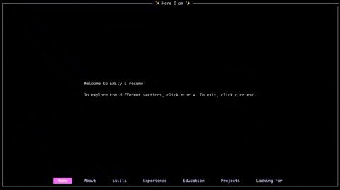

# Emily's Resume

A Haskell application all about me, in the command line!



## To run

To view the resume with Docker:

```
docker run -it emilywoods/resume
```

Or to build and run the project locally. First clone the repository, and then run:

```
make run
```

This project was inspired by [another Rust-based CV application](https://github.com/maitesin/rust-cv).
